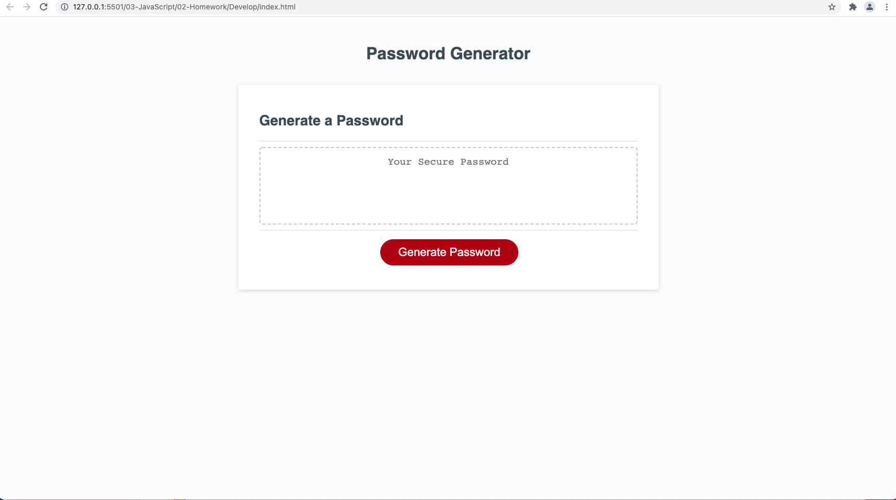

## Taylor Anderson
## Password Generator

## Your Task

Create a random password generator with specific criteria. 


## link to deployed applicaiton: https://newengood.github.io/homework-03-submission/
## Link to github repository:  https://github.com/newengood/homework-03-submission

## Acceptance Criteria

```
GIVEN I need a new, secure password
WHEN I click the button to generate a password
THEN I am presented with a series of prompts for password criteria - [X]
WHEN prompted for password criteria
THEN I select which criteria to include in the password - [X]
WHEN prompted for the length of the password
THEN I choose a length of at least 8 characters and no more than 128 characters - [X]
WHEN asked for character types to include in the password
THEN I confirm whether or not to include lowercase, uppercase, numeric, and/or special characters - [X]
WHEN I answer each prompt
THEN my input should be validated and at least one character type should be selected - [X]
WHEN all prompts are answered
THEN a password is generated that matches the selected criteria - [X]
WHEN the password is generated
THEN the password is either displayed in an alert or written to the page - [X]
```

## Mock-Up

The following image shows the web application's appearance and functionality:



### Technical Acceptance Criteria: 40%

* Satisfies all of the preceding acceptance criteria plus the following:

  * The homework should not produce any errors in the console when you inspect it using Chrome DevTools. - [X]

### Deployment: 32%

* Application deployed at live URL. - [X]

* Application loads with no errors. - [X]

* Application GitHub URL submitted. - []

* GitHub repository that contains application code. - [X]

### Application Quality: 15%

* Application user experience is intuitive and easy to navigate. - [X]

* Application user interface style is clean and polished. - [X]

* Application resembles the mock-up functionality provided in the homework instructions. - [X]

### Repository Quality: 13%

* Repository has a unique name. - [X]

* Repository follows best practices for file structure and naming conventions. - [X]

* Repository follows best practices for class/id naming conventions, indentation, quality comments, etc. - [X]

* Repository contains multiple descriptive commit messages. - [X]

* Repository contains quality readme file with description, screenshot, and link to deployed application.- [X]


- - -
© Newengood
